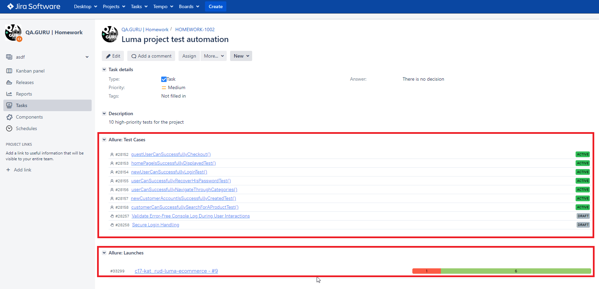

# Test automation project for https://magento.softwaretestingboard.com


>Luma is a demo online store built on Magento CMS

## :pushpin: Table of contents
- [Technologies and tools](#technologist-technologies-and-tools)

## :computer: Technologies and tools
<p align="center">


</p>

### Project Description

#### Autotests

The autotests for this project are written in Java and utilize the following tools and frameworks:

- **Selenide framework**: Used for UI tests
- **Gradle**: A build automation tool
- **JUnit5**: Used for executing the tests
- **Jenkins**: Used for CI/CD to run tests remotely
- **Selenoid**: Enables running tests remotely in browsers launched in Docker containers
- **Allure Report**: Utilized for visualizing test results
- **Allure TestOps**: Implemented as a Test Management System
- **Telegram Bot**: Used for test results notifications

#### Allure Report Details

An Allure report includes:

- Test steps
- A screenshot of the browser page when the test is completed
- Page source
- Browser console logs
- A video of the test running

## :computer: How to run the tests from Terminal
### Running the tests locally
```
gradle clean test
```
### Running the tests remotely
```
clean test -Dremote=${REMOTE} -Dremote_login=${REMOTE_LOGIN} -Dremote_pass=${REMOTE_PASS} -Dresolution=${RESOLUTION} -Dbrowser=${BROWSER} -Dbrowser_version=${VERSION}
```
You need to specify the following parameteres:
* <code>REMOTE</code> - a remote server to run the tests
* <code>REMOTE_LOGIN</code> - the server login
* <code>REMOTE_PASS</code> - the server password
* <code>RESOLUTION</code> - a browser window resolution (<code>1920x1080</code> by default)
* <code>BROWSER</code> - a browser (<code>chrome</code> by default)
* <code>VERSION</code> - the browser version (<code>100.0</code> by default)

##  How to run the tests in [Jenkins](https://jenkins.autotests.cloud/job/c17-kat_rud-luma-ecommerce/)
Click <code>**Build With Parameters**</code> and select values for the options. Click <code>**Build**</code> button to start a build.
<p align="center">
  
</p>

After the build is completed in <code>**Build History**</code> section you will find <code>**Allure Report**</code> link right at the latest build. Click it to view the results on an HTML generated page.
<p align="center">
  
</p>

##  Test results in [Allure Report](https://jenkins.autotests.cloud/job/c17-kat_rud-luma-ecommerce/allure/)
<p align="center">
  
</p>

##  Integration with [Allure TestOps](https://allure.autotests.cloud/launch/33209)
<p align="center">
  
</p>

##  Integration with [Jira](https://jira.autotests.cloud/browse/HOMEWORK-1002)
<p align="center">
  
</p>

##  Telegram notifications
After the build is completed, a special bot created in <code>Telegram</code>, automatically processes and sends a test run report message.

<p align="center">

</p>
